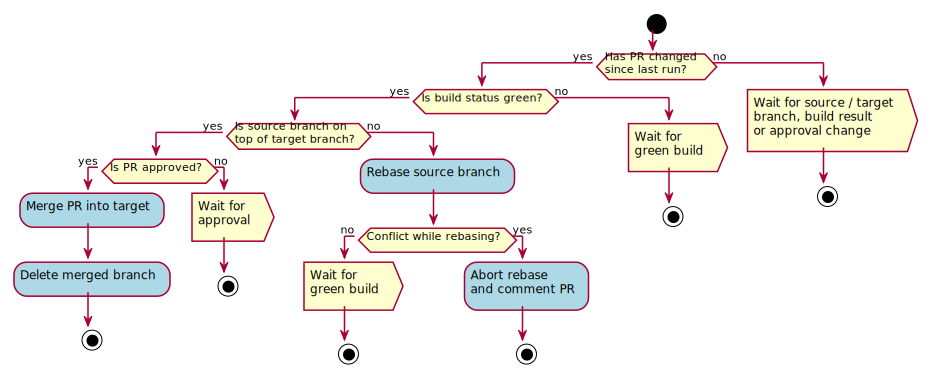

# rebazer

Helper service to handle pull requests (PRs) on Bitbucket. Rebase PRs against target to streamline commit history. Every 60 seconds, the `rebazer` app polls Bitbucket and processes each open PR as follows:

1. Is there a change since the last poll? Yes: continue, no: end.
2. Is the corresponding build stable? Yes: continue, no: end.
3. Is a rebase necessary? Yes: continue, no: end.
4. Rebase.
5. Is there a merge conflict? Yes: leave a comment and end, no: continue.
6. Is the PR approved? Yes: continue, no: end.
7. Merge.

Illustrated as a flowchart:

## Prerequisites

Before building the `rebazer` application, please make sure that the following tools are installed:

* Java 8
* Maven (3.0+)
* Git

## Configuration

`rebazer` relies on several parameters, which need to be specified inside a `.yml` configuration and made available to the program. An example can be found in [application.yml.example](src/main/resources/application.yml.example).

### Mandatory:

| Parameter              | Explanation                                             |
|------------------------|---------------------------------------------------------|
| `rebazer.team`         | Your Bitbucket team                                     |
| `rebazer.user`         | Your Bitbucket username                                 |
| `rebazer.pass`         | Your Bitbucket password                                 |
| `rebazer.workspace`    | Location where handled repositories should be cloned to |
| `rebazer.repos`        | List of repositories that are handled by rebazer        |
| `rebazer.repos.name`   | Name of the repository                                  |
| `rebazer.repos.branch` | Default branch to check out                             |

### Optional:

| Parameter                            | Explanation                                     | Default |
|--------------------------------------|-------------------------------------------------|---------|
| `rebazer.garbageCollectionCountdown` | Number of rebases after which a GC is triggered | 20      |

## Building

A typical build involves calling the `package` target via maven from the root of the cloned repository:

`mvn clean package`

Two major artifacts are then build inside the `target` directory: `rebazer-$VERSION.jar` and `rebazer_$VERSION_all.deb`.

### Fat JAR

This JAR can basically be run everywhere a JVM is present; there are no further dependencies. However, for a successful start, several parameters need to be configured (see configuration section for details). There are quite a [number](https://docs.spring.io/spring-boot/docs/current/reference/html/boot-features-external-config.html#boot-features-external-config-command-line-args) of ways to specify these parameters.

If e.g. all parameters are specified in a file called `application.yml`, the following command should be sufficient for starting `rebazer`:

`java -jar rebazer-VERSION.jar --spring.config.location=file:./application.yml`

### Debian package

**Attention**: We don't ship a fully functional configuration for this package. So after installation, one must ensure that a proper configuration is placed in `/etc/rebazer`. Also make sure that the configuration file is accessible by the user `rebazer`.

This package automatically creates:

* System user for running `rebazer`
* Proper logging via systemd/syslog (to `/var/log/rebazer`)
* Systemd service named `rebazer.service`
* Workspace in `/var/lib/rebazer` (can be configured in `/etc/defaults/rebazer`)

The debian package overwrites the `rebazer.workspace` parameter via an [environment](src/deb/etc/default/rebazer) variable.

## Troubleshooting

>Symptom: Errors during startup

Solution: Please make sure the folder `/etc/rebazer` contains a valid configuration and the user `rebazer` has access to it.
